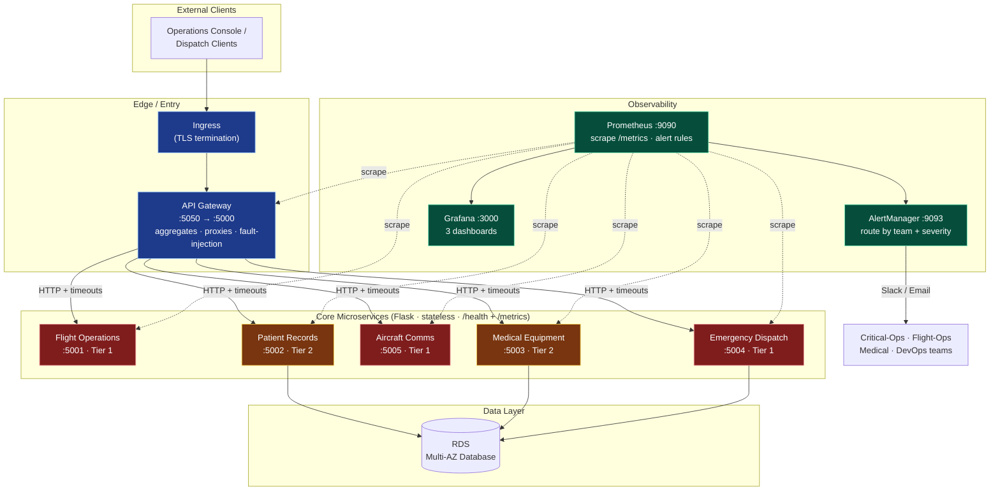
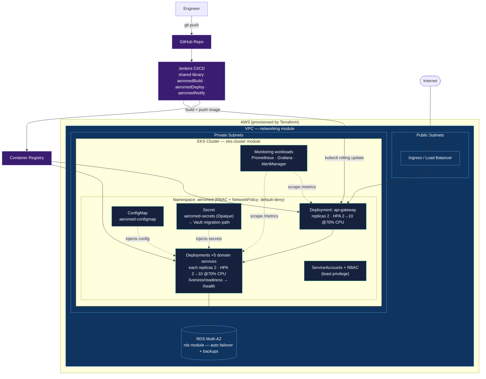
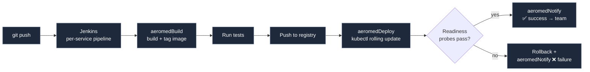
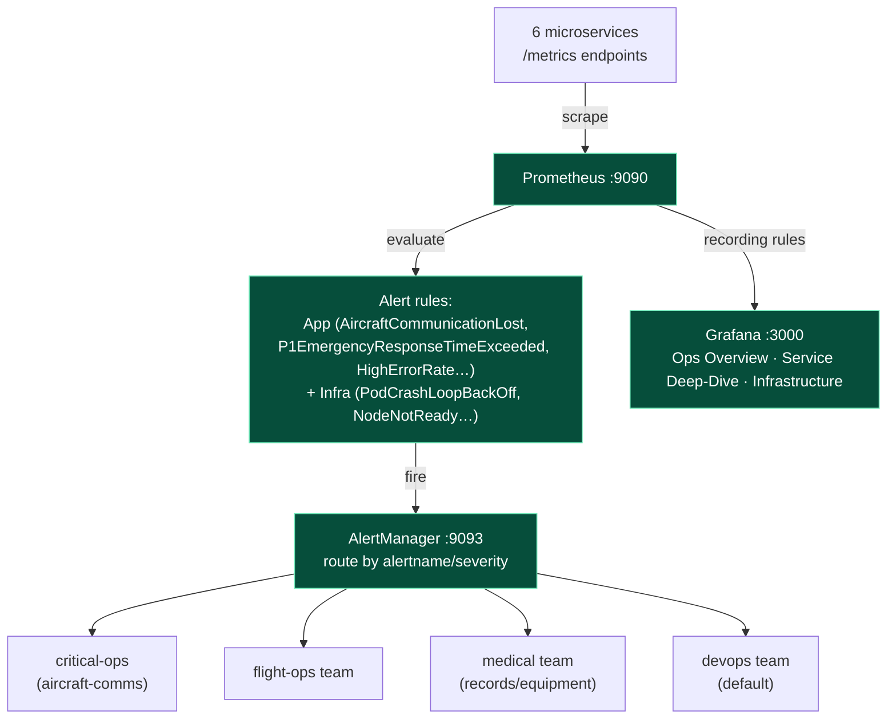
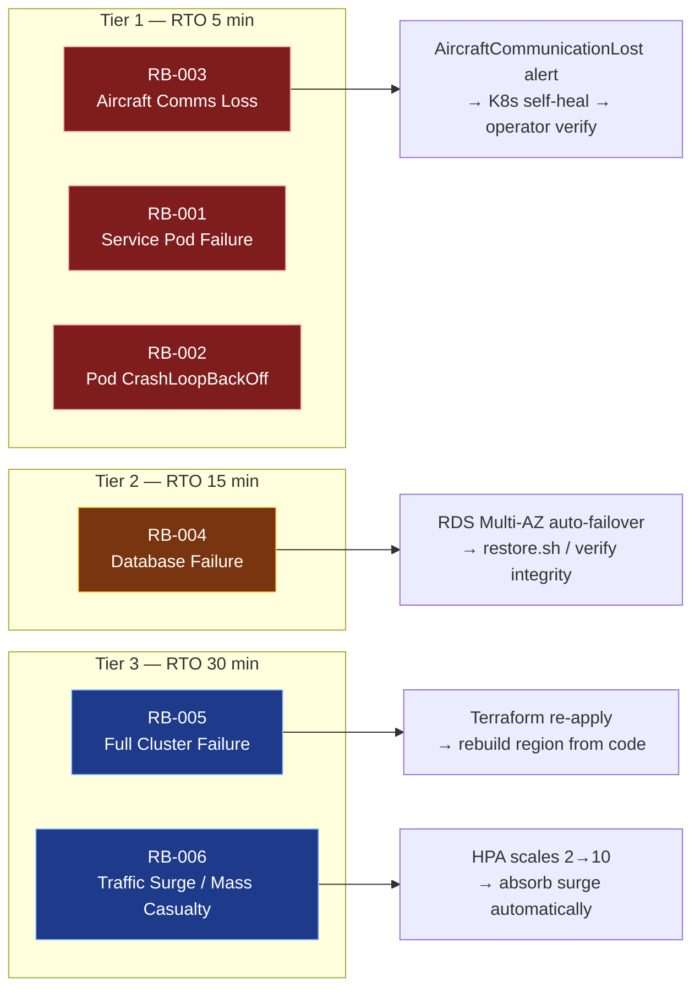

# AeroMed DevOps Platform — Architecture & Deployment Diagrams
### Case Study 75: Critical Care Air Ambulance Operations Platform

All diagrams below are written in **Mermaid** and render natively on GitHub, VS Code
(with a Mermaid extension), and most Markdown viewers. They are generated directly from
the actual codebase — ports, replica counts, modules, and service names all match the
implementation.

---

## 1. System Architecture (Logical)

High-level view of the microservices, how requests flow, and how observability and CI/CD
attach to the platform.

**Key design points**
- **Single entry point** — only the API Gateway is internet-facing; the five domain services are never exposed directly.
- **Fault isolation** — gateway→service calls use explicit HTTP timeouts, so a slow/down dependency degrades gracefully instead of cascading.
- **Tiering drives DR** — Tier 1 (red) = 5-min RTO, Tier 2 (amber) = 15-min RTO.
- **Observability is pull-based** — Prometheus scrapes every `/metrics` endpoint; nothing in the request path depends on the monitoring stack.

---

## 2. Deployment Architecture (Kubernetes on AWS EKS)

Physical/runtime view: how the services are deployed, scaled, secured, and exposed inside
the cluster, and how the cluster sits on AWS infrastructure provisioned by Terraform.

**Resilience features visible here**
- **2-replica minimum** per service across nodes → no single pod/node loss causes an outage.
- **HPA 2→10 @ 70% CPU** → automatic absorption of traffic surges (RB-006).
- **RDS Multi-AZ** → automatic database failover (RB-004).
- **Default-deny NetworkPolicy + RBAC** → lateral-movement and privilege containment.
- **Rolling updates** from Jenkins → zero-downtime deploys.

---

## 3. CI/CD Pipeline Flow

The three **shared-library steps** (`aeromedBuild`, `aeromedDeploy`, `aeromedNotify`) are
defined once and reused by all six service pipelines — single point of change, consistent
behavior everywhere.

---

## 4. Monitoring & Alert Routing Flow

---

## 5. Disaster Recovery Map (Runbooks ↔ Scenarios ↔ RTO)

---

### How to export these as images (for screenshots / slides)
- **GitHub**: push the repo — diagrams render automatically in the rendered Markdown.
- **VS Code**: install "Markdown Preview Mermaid Support", open preview, screenshot.
- **CLI**: `npx @mermaid-js/mermaid-cli -i docs/architecture-diagram.md -o diagram.png`
- **Online**: paste any block into <https://mermaid.live> and export PNG/SVG.
